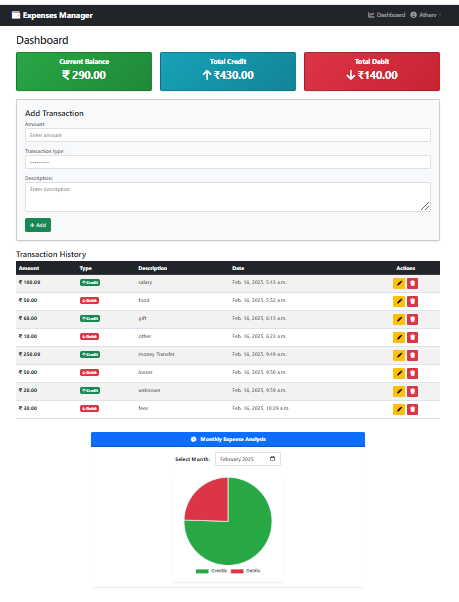
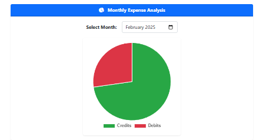
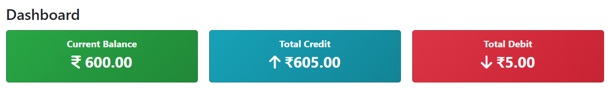
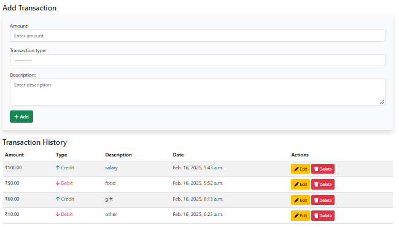
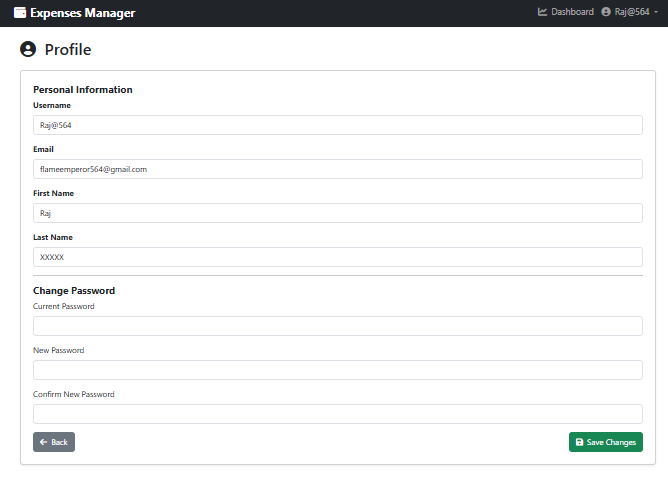

# 💰 Expense Management System (Django)  
A simple and interactive **Expense Tracker** built with Django, Bootstrap, and SQLite.  
This system helps users **manage their credits, debits, and total balance in ₹ Rupees**.

  

---

## 🚀 Features  

### 🔐 **User Authentication (Login/Register)**
- Secure **User Registration & Login**
- **Django Authentication System** with password hashing
- Logout functionality to protect user sessions  

### 📊 **Dashboard & Expense Tracking**
- Displays **Current Balance (₹)**
- Shows **Total Credits & Total Debits**
- **Add, Edit & Delete Transactions**
- Categorized Transactions: **Credit (Income) & Debit (Expense)**

### 🧑‍💻 **User Profile & Settings**  
- View and update **Username, Email, First & Last Name**  
- Change **Password** with validation  
- Profile popup accessible directly from the **Dashboard**  
- Secure password update with confirmation  
- Dynamic UI for seamless profile updates 

### 📈 **Expense Analysis with Charts**
- **Pie Chart for Monthly Expense Breakdown**
- **Smooth Animations & Dynamic Updates**
- Data updates instantly when transactions are added  

### 🎨 **User-Friendly Interface**
- **Modern UI** with Bootstrap 5  
- **FontAwesome Icons** for a better experience  
- **Mobile Responsive Design** 📱

### 📤 **Excel Export**
- Export transactions to Excel.
- Download Excel files with transaction details such as amount, type (credit/debit), description, and date.
- The Excel file is generated dynamically based on the user's transaction history.

---


## 📊 Expense Visualization  
The **Pie Chart** dynamically updates when transactions are added.  
🟢 **Green → Credits (₹)**  
🔴 **Red → Debits (₹)**  

  

---

## 📸 Screenshots  

### **Dashboard (Balance & Transactions in ₹ Rupees)**  
  

### **Add Transaction (Credits/Debits in ₹)**  
  

### **Profile (Personal Information/Password Change)**  
 
---

## 🔧 Installation  
### 1️⃣ **Clone the Repository**
```sh
git clone https://github.com/Atharv564/expense-management.git
cd expense-management
```
### 2️⃣ **Create & Activate a Virtual Environment**
```sh
python -m venv env
source env/bin/activate  # On Windows: env\Scripts\activate
```
### 3️⃣ **Install Dependencies**
```sh
pip install django
pip install openpyxl  
```
### 4️⃣ **Run Migrations**
```sh
python manage.py migrate
```
### 5️⃣ **Create a Superuser**
```sh
python manage.py createsuperuser
```
### 6️⃣ **Run the Server**
```sh
python manage.py runserver
```


## 🔧 Technologies Used  

🔹 **Django** - Backend Framework 🐍  
🔹 **SQLite** - Database 💾  
🔹 **Bootstrap** - UI Framework 🎨  
🔹 **FontAwesome** - Icons & Design ✨  
🔹 **Chart.js** - Pie Chart for Expense Analysis 📊  


## 👨‍💻 Developed By   [Atharv..](https://github.com/Atharv564)
